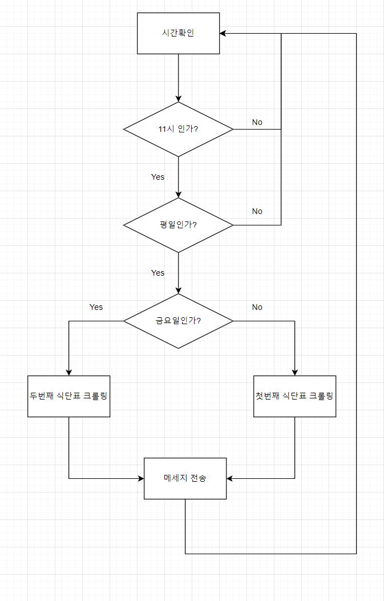
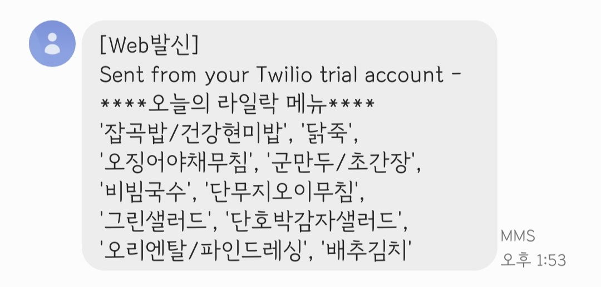

# 라일락 식단표 문자 전송 프로그램

<aside>
💡 **개요**
매일아침 오늘의 라일락 메뉴가 뭔지 알아보는게 귀찮아서 만들게 되었습니다.

</aside>

## 플로우 차트



## 사용한 Library

```python
#크롤링을 위한 라이브러리
from urllib.request import urlopen
from bs4 import BeautifulSoup

#문자 전송을 위한 라이브러리
from twilio.rest import Client
from datetime import date

#스케쥴링을 위한 라이브러리
import schedule
import time

import sys
print(sys.version)
```

매주 금요일이 되면 새식단표가 올라와, 금요일에는 두번째 식단표를 크롤링해야해서 함수를 두가지로 만들었습니다.

## 첫번째 식단표 크롤링 함수

```python
def this_week() :

  main = 'https://www.pknu.ac.kr/main/399'
  html = urlopen(main)  
  soup = BeautifulSoup(html, "html.parser") 
  hotKeys = soup.select("a")[199]['href']

  adr = f'{main}{hotKeys}'
  html = urlopen(adr)

  soup = BeautifulSoup(html, "html.parser") 
  hotKeys = soup.select("p")
  menu = []

  for t in hotKeys[28:93]:
    #print(t)
    a=str(t)[:89]
    #print(a)
    if(a=='<p style="margin: 0pt; word-break: keep-all; vertical-align: bottom; line-height: 130%;">'):
      #print(t)
      menu.append(t)

  week = [[], [], [], [], []]
  idx = 0
  before = 0
  for n,i in enumerate(menu) :

    

    if str(i)[-5] == '밥' and n !=0 and n - before > 3  :
      idx += 1
      before = n
      week[idx].append(str(i)[89:-4])
    
    else:
      week[idx].append(str(i)[89:-4])
    
  return week
```

## 두번째 식단표 크롤링 함수

```python
def before_week() :

  main = 'https://www.pknu.ac.kr/main/399'
  html = urlopen(main)  
  soup = BeautifulSoup(html, "html.parser") 
  hotKeys = soup.select("a")[200]['href']

  adr = f'{main}{hotKeys}'
  html = urlopen(adr)

  soup = BeautifulSoup(html, "html.parser") 
  hotKeys = soup.select("p")
  menu = []

  for t in hotKeys[28:93]:
    #print(t)
    a=str(t)[:89]
    #print(a)
    if(a=='<p style="margin: 0pt; word-break: keep-all; vertical-align: bottom; line-height: 130%;">'):
      #print(t)
      menu.append(t)

  week = [[], [], [], [], []]
  idx = 0
  before = 0
  for n,i in enumerate(menu) :

    

    if str(i)[-5] == '밥' and n !=0 and n - before > 3  :
      idx += 1
      before = n
      week[idx].append(str(i)[89:-4])
    
    else:
      week[idx].append(str(i)[89:-4])

  return week
```

## 문자 메세지 보내는 함수

twilio의 api를 사용하여 문자 보내는 기능을 만들었습니다.

```python
#twilio_setting 
account_sid = '__'
auth_token = '__'
client = Client(account_sid, auth_token)

#send message
def send_msg():
  
  
  today = date.weekday(date.today())

  if (today < 4):
    week = this_week()
    ms = f'****오늘의 라일락 메뉴****\n{str(week[today])[1:-1]}'

  elif(today==4):
    week = before_week()
    ms = f'****오늘의 라일락 메뉴****\n{str(week[today])[1:-1]}'

  if(today < 5):
    message = client.messages.create(
        to="+821012341234", 
        from_="+123123123",
        body=ms)
  
    print('메세지 전송 완료')

#print(message.sid)
```

## 스케줄 함수

schedule 라이브러리를 사용하여 매일 11시가 되면 메세지 보내기 함수를 활성화 시켰습니다.

```python
#주기 설정
schedule.every().day.at("11:00").do(send_msg)

while True:
    schedule.run_pending()
    time.sleep(1)
```

## 결과

